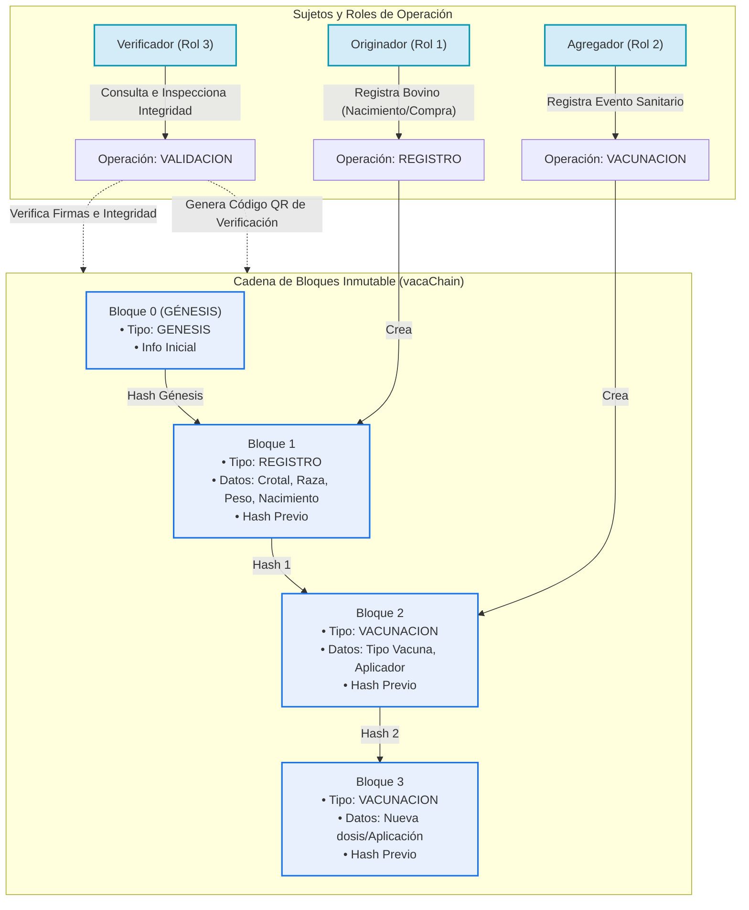

# Blockchain Bovina - Trazabilidad Inmutable ⛓️🐄

Este proyecto es una plataforma interactiva que implementa una **cadena de bloques (blockchain) descentralizada a nivel de cliente** para garantizar la trazabilidad inmutable y seguridad sanitaria en el hato ganadero. Permite registrar bovinos desde su origen, agregar eventos sanitarios (vacunación) de forma segura y verificar la integridad completa del histórico de datos mediante criptografía SHA-256.

---

## 🏗️ Arquitectura y Funcionamiento

La aplicación se rige por un esquema de cadena de bloques y roles distribuidos, modelado de la siguiente manera:



### Estructura de un Bloque Criptográfico
Cada bloque dentro de la cadena contiene:
* **Índice (`indice`)**: Posición consecutiva del bloque en la cadena.
* **Marca de Tiempo (`marcaTiempo`)**: Fecha y hora exactas de acuñación del bloque.
* **Tipo de Transacción (`tipo`)**: `REGISTRO` o `VACUNACION`.
* **Datos (`datos`)**: Estructura JSON con la información bovina o vacunas aplicadas.
* **Rol Emisor (`rol`)**: Identificador del perfil que firmó la transacción.
* **Hash Previo (`hashPrevio`)**: Firma criptográfica del bloque anterior.
* **Hash Actual (`hash`)**: Hash generado con SHA-256 combinando todo el contenido del bloque actual + el Hash Previo.

---

## ✨ Características Principales

1. **Inmutabilidad Criptográfica**: Cada bloque está enlazado criptográficamente usando **SHA-256**. Cualquier intento de manipular los datos del pasado romperá el enlace de la cadena, alertando inmediatamente al validador con un escudo rojo de "Cadena Inválida".
2. **Sistema de Roles Dinámico**:
   * **Originador (Rol 1)**: Registra la identidad del bovino (Crotal, Peso, Raza, Sexo y Fecha de Nacimiento).
   * **Agregador (Rol 2)**: Visualiza el hato en el inventario y graba de forma inmutable cada vacuna aplicada.
   * **Verificador (Rol 3)**: Muestra el visor de trazabilidad lineal, regenera y verifica los hashes dinámicamente, y permite generar códigos QR para auditoría física.
3. **Persistencia Local**: Los bloques y estados de sesión se almacenan de forma segura e inmediata en el `localStorage` del navegador.
4. **Diseño Moderno y Responsivo**: Interfaz fluida basada en CSS Vanilla con colores armoniosos, variables CSS y adaptabilidad a dispositivos móviles.

---

## 🛠️ Tecnologías Utilizadas

* **Estructura**: HTML5 Semántico.
* **Estilos**: CSS Vanilla con layouts flexibles y diseño de tarjetas moderno.
* **Lógica**: JavaScript (Modularizado con Clases Orientadas a Objetos en `js/`).
* **Criptografía**: [CryptoJS](https://cdnjs.cloudflare.com/ajax/libs/crypto-js/4.2.0/crypto-js.min.js) (SHA-256).
* **Códigos QR**: [QRCode.js](https://cdnjs.cloudflare.com/ajax/libs/qrcodejs/1.0.0/qrcode.min.js).

---

## 🚀 Cómo Ejecutar el Proyecto

Dado que es una SPA (Single Page Application) estática en el lado del cliente, puedes ejecutarla en segundos de las siguientes formas:

### Método Directo
Haz doble clic en el archivo **`index.html`** en la carpeta del proyecto para abrirlo en cualquier navegador web.

### Usando un Servidor de Desarrollo Rápido (Recomendado)
Para evitar bloqueos locales y simular un entorno de producción, abre tu terminal en la carpeta raíz y ejecuta:
```bash
npx serve
```
O de forma alternativa:
```bash
npx http-server
```
Copia y pega la dirección devuelta en tu navegador (usualmente `http://localhost:3000` o `http://localhost:8080`).
